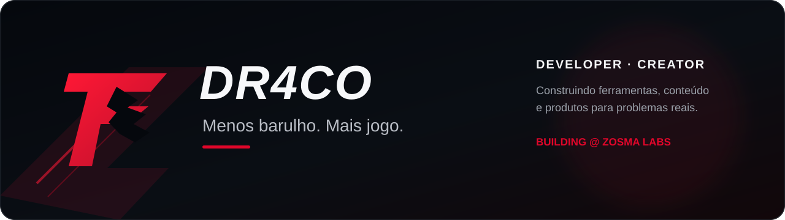
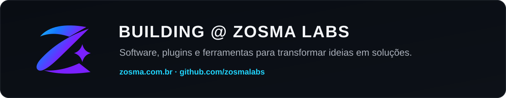

 

### Developer · Creator · Builder

Crio ferramentas, conteúdo e produtos para transformar problemas reais em soluções simples e úteis.

---

## Sobre

Sou **Dr4co**. Trabalho na interseção entre desenvolvimento, produção, música, mídia e automação, criando soluções práticas para fluxos que normalmente exigem etapas demais.

Meu foco é simples: **menos complexidade, mais resultado**.

---

## Building @ Zosma Labs

Na **Zosma Labs**, desenvolvo produtos independentes para produção, apresentações, mídia e workflows técnicos — de plugins integrados a aplicações completas.

[**Conhecer a Zosma Labs →**](https://github.com/zosmalabs)

---

## O que estou construindo

- **SPresenter** — plugins e automações para projeção, mídia e operação ao vivo.
- **REAPER** — ferramentas para playback, setlists, click, projeção e controle de palco.
- **NDI** — soluções portáteis para transmissão de tela, janela, vídeo e áudio.
- **Conteúdo** — tutoriais, testes e demonstrações no canal Dr4co TV.

---

## Projetos em destaque

| Projeto | Área | Link |
| --- | --- | --- |
| **Fundos por Culto** | Automação para SPresenter | [Ver projeto](https://github.com/zosmalabs/fundos-por-culto-spresenter) |
| **Importador de Vídeos** | Mídia e integração com SPresenter | [Ver projeto](https://github.com/zosmalabs/importador-videos-spresenter) |
| **Fundos Para Letras** | Personalização de letras no SPresenter | [Ver projeto](https://github.com/zosmalabs/fundos-para-letras-spresenter) |
| **Zosma Transmitter** | Transmissão NDI portátil | [Ver projeto](https://github.com/zosmalabs/zosma-transmitter) |
| **Multitrack Tools** | Playback ao vivo para REAPER | [Conhecer](https://zosma.com.br/multitrack-tools/) |

---

### Menos barulho. Mais jogo.

**Dr4co** · Developer · Creator · Zosma Labs

